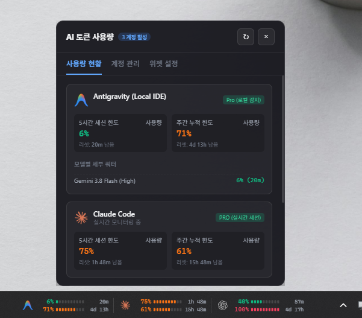
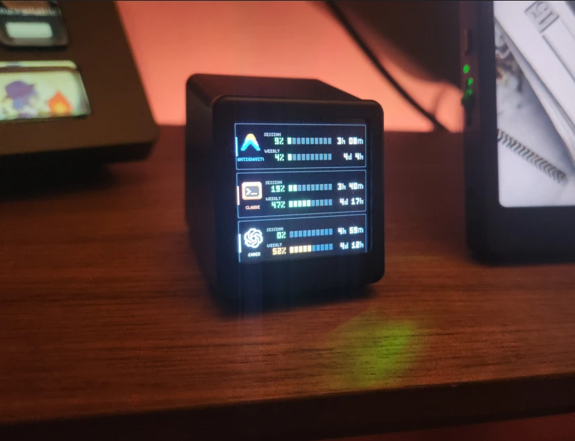

# Taskbar AI Token Usage Widget

[한국어](README.md) | **English**

A lightweight Windows desktop widget that sits on the taskbar and monitors, in real time, the 5-hour session quota, weekly usage, and reset countdowns of multiple AI accounts (Antigravity, Claude, Codex, and custom AI).



---

## Features

1. **Two taskbar placement modes**:
   - **Docked (default)**: The widget window is attached as a child window of the taskbar (`Shell_TrayWnd`) and shown inside it. Clicks are ignored while another window or a fullscreen app covers the widget, so dragging a fullscreen video's progress bar never pops up the details panel.
   - **Floating**: Shown as an overlay right above the taskbar. Offers an "Always on Top" option, hides automatically while a fullscreen app is running, and reappears when fullscreen ends.
   - Left/right alignment, horizontal offset, and vertical fine-tuning sliders.
   - Transparent background with alpha blur (`backdrop-filter: blur(16px)`) blends seamlessly into the taskbar.

2. **Four reference-design themes**:
   - **Theme 1a (bar gauges · 5H / WK in two rows + reset countdown)**:
     - 5H gauge bar + 68% + 2h 41m / WK gauge bar + 42% + 3d 9h
   - **Theme 1b (numbers first · segmented ticks, monospace)**:
     - Status dot + monospace numbers + 12-segment dashed progress bar + 2h 41m
   - **Theme 1c (dual ring gauge · outer = 5 hours, inner = weekly)**:
     - Outer ring (5 hours) + inner ring (weekly) SVG donut chart with the AI icon in the center
   - **Theme 1d (ultra compact · two-row stacked bars for narrow taskbars)**:
     - Icon + 5H 68% 2h 41m / WK 42% 3d 9h + an ultra-thin stacked line at the bottom

3. **Two AI icon modes**:
   - **Original colors**: Brand colors (Claude orange, Gemini mint/blue, Mistral blue, Grok purple, etc.).
   - **Desaturated (monochrome)**: A minimal black-and-white / grayscale taskbar style.

4. **Usage-based colors**:
   - Colors switch across three thresholds (0–59% normal green &rarr; 60–84% caution orange &rarr; 85–100% warning red).

5. **Account integrations & unlimited multi-account management**:
   - **Antigravity (no authentication)**: Uses the already signed-in `agy` CLI as a bridge. The app parses the output of `agy -p "/usage" --output-format json` (read-only, consumes no quota), so it never handles accounts, tokens, or keys. Requires `agy` CLI 1.1.11 or later; if the CLI is missing or unresponsive, the last measured value or an error state is shown.
   - **Claude**: Shows a single Claude account. It first tries the CLI login, then uses the Windows desktop app's existing session to fetch live 5-hour and weekly usage and reset times, without another login or closing the app. It discovers standalone and Microsoft Store data directories and reads the OAuth V2 cache from `config.json` and the encryption key from `Local State`. Tokens, account IDs, and user paths are never hardcoded or logged. If live lookup fails, it falls back to `plan-usage-history.json`; records older than an hour are marked stale, and missing reset times appear as `--`.
   - **Custom/mock accounts**: Add, toggle, and remove as many accounts as you like.

6. **Details popup on click (with motion)**:
   - Clicking the widget or the tray icon slides a popup up right above the taskbar.
   - Turn on "Open Popup with Double-click" in settings to require a double-click, preventing accidental popups.
   - Organized into Usage, Accounts, Settings, and API tabs with live countdowns, account management, and widget settings.

7. **Lightweight with a configurable refresh interval**:
   - Ultra-light CSS/DOM rendering (0% idle CPU).
   - Selectable refresh interval (15 s, 30 s, 1 min, 2 min, 5 min).

8. **Launch at Windows startup (Auto-Launch)**:
   - Toggle launch-at-startup with one click from the tray menu or the widget's settings tab.

9. **Usage API push & external display**:
   - Enable push in the **API** tab of the settings and set an endpoint URL (default `http://localhost:8080/api/usage`) and a screen number; usage data is sent via HTTP POST on every quota refresh.
   - Ships with custom firmware for the GeekMagic SmallTV (ESP8266), so you can show session/weekly usage and reset countdowns on a small desk display. See [`firmware/README.md`](firmware/README.md) for installation (Korean).

   

---

## Installation

### 1. Download a release build (users)
Download the latest `AI-Usage-Widget-vX.X.X-win-x64.zip` from the **Releases** section of this GitHub repository, extract it, and run `AI Usage Widget.exe`.

### 2. Build from source (developers)

#### Install dependencies
```bash
npm install
```

#### Environment variables (optional)
If the Codex executable is not in its default location, set the `CODEX_EXECUTABLE` system environment variable to its path. (See `.env.example`.)

#### Build and run
```bash
# Compile the native C# helper (TaskbarDock.exe) + TypeScript + Vite bundle
npm run build

# (Optional) Recompile only the native helper (uses .NET Framework 4 csc.exe)
npm run build:native

# Run the app
npm start

# Tests
npm test
```

#### Packaging
```bash
# Portable (directory) Windows package
npm run dist

# Zip package for distribution (the format uploaded to Releases)
npm run dist:zip
```
