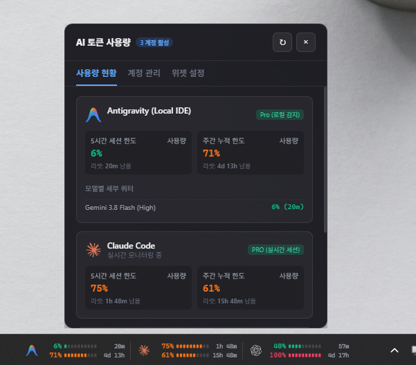

# Taskbar AI Token Usage Widget (작업표시줄 AI 토큰 사용량 모니터 위젯)

Windows 작업표시줄 상에 위치하여 복수의 AI 계정(Antigravity, Claude, Codex, 커스텀 AI)의 5시간 세션 쿼터 및 주간 사용량, 리셋 카운트다운을 실시간으로 모니터링하는 초경량 데스크톱 위젯입니다.



---

## 주요 기능 및 사양 구현 현황

1. **작업표시줄 위치 최적화**:
   - Windows 10/11 작업표시줄 트레이(알림 영역) 좌측 또는 지정 오프셋 거리에 플로팅 오버레이로 배치.
   - 트레이 거리 조절 슬라이더(0~250px) 및 우측/좌측 정렬 모드 제공.
   - 투명 배경 및 알파 블러(`backdrop-filter: blur(16px)`)로 작업표시줄 배경색과 완벽 일체화.

2. **레퍼런스 디자인 4종 테마 지원**:
   - **Theme 1a (바 게이지 · 5H / WK 2행 + 리셋 카운트다운)**:
     - 5H 게이지 바 + 68% + 2h 41m / WK 게이지 바 + 42% + 3d 9h
   - **Theme 1b (숫자 우선 · 세그먼트 눈금, 모노스페이스)**:
     - 상태 도트 + 모노스페이스 숫자 + 12개 직사각형 세그먼트 대시 진행바 + 2h 41m
   - **Theme 1c (이중 링 게이지 · 외곽=5시간, 내부=주간)**:
     - 외곽 링(5시간) + 내부 링(주간) SVG 도넛 차트 및 중앙 AI 아이콘
   - **Theme 1d (초압축 · 좁은 작업표시줄용 2행 스택 바)**:
     - 아이콘 + 5H 68% 2h 41m / WK 42% 3d 9h + 하단 초슬림 스택 라인

3. **AI 아이콘 2종 모드**:
   - **오리지널 컬러**: 브랜드 고유 컬러(Claude 오렌지, Gemini 민트/블루, Mistral 블루, Grok 퍼플 등).
   - **채도 없음 (모노크롬)**: 미니멀한 흑백/그레이스케일 작업표시줄 스타일.

4. **사용량에 따른 색상 변화**:
   - 3단계 임계값 색상 동적 전환 (0~59% 정상 그린 &rarr; 60~84% 주의 오렌지 &rarr; 85~100% 경고 레드).

5. **계정 기반 인증 & 다중 계정 무제한 관리**:
   - **Antigravity 연동 (무인증)**: 이미 로그인된 `agy` CLI를 브리지로 사용합니다. `agy -p "/usage" --output-format json`(읽기 전용, 쿼터 소비 없음)의 결과를 파싱하므로 앱이 계정·토큰·키를 다루지 않습니다. `agy` CLI 1.1.11 이상이 필요하며, CLI가 없거나 응답이 없으면 마지막 실측값 또는 오류 상태를 표시합니다.
   - **Claude 연동**: Claude 계정은 하나만 표시합니다. CLI 로그인으로 실시간 사용량 조회를 먼저 시도하고, 실패하면 Windows 데스크톱 앱의 `%APPDATA%\Claude\plan-usage-history.json` 기록에서 5시간·7일 사용률을 읽습니다. 앱 기록이 한 시간 이상 갱신되지 않으면 오래된 값으로 표시합니다. 앱 기록에는 리셋 시각이 없어 `--`로 표시합니다.
   - **커스텀/목 계정 지원**: 원하는 만큼 계정 추가/비활성화 토글/삭제 가능.

6. **마우스 호버 & 클릭 시 디테일 팝업창 (모션 애니메이션)**:
   - 마우스 호버(350ms) 또는 클릭 시 작업표시줄 바로 위로 슬라이드업되는 팝업창.
   - 모델별 세부 쿼터 잔여율(Gemini 2.5 Flash, Pro, Claude 등), 실시간 초 단위 카운트다운, 계정 관리 및 위젯 설정 제공.

7. **경량성 및 사용자 지정 주기**:
   - CSS 및 DOM 기반 초경량 구동 (CPU 유휴 점유율 0%).
   - 업데이트 주기 사용자 선택 (15초, 30초, 1분, 2분, 5분).

8. **윈도우 시작 시 자동 실행 (Auto-Launch)**:
   - 작업표시줄 트레이 메뉴 및 위젯 설정 탭에서 원클릭으로 윈도우 시작 시 자동 실행 설정/해제 지원.

---

## 설치 및 실행 방법

### 1. 빌드된 배포판 다운로드 (일반 사용자)
GitHub 저장소 우측의 **Releases** 탭에서 최신 버전의 `AI-Usage-Widget-vX.X.X-win-x64.zip`을 다운로드하여 압축을 풀고 `AI Usage Widget.exe`를 실행하세요.

### 2. 소스 코드 빌드 및 실행 (개발자)

#### 의존성 설치
```bash
npm install
```

#### 환경변수 (선택 사항)
Codex 실행 파일이 기본 경로에 없다면 시스템 환경변수 `CODEX_EXECUTABLE`에 경로를 지정합니다. (`.env.example` 참고)

#### 빌드 및 실행
```bash
# 네이티브 C++/C# 데몬 컴파일 + TypeScript + Vite 번들링
npm run build

# (선택) C++ Win32 데몬 단독 컴파일 (Clang / MinGW / MSVC 필요)
npm run build:native:cpp

# 앱 실행
npm start
```

#### 배포 패키징
```bash
# Windows 무설치(디렉터리형) 배포 패키지 생성
npm run dist

# 배포용 zip 압축 패키지 생성 (Releases에 올리는 형식)
npm run dist:zip
```

